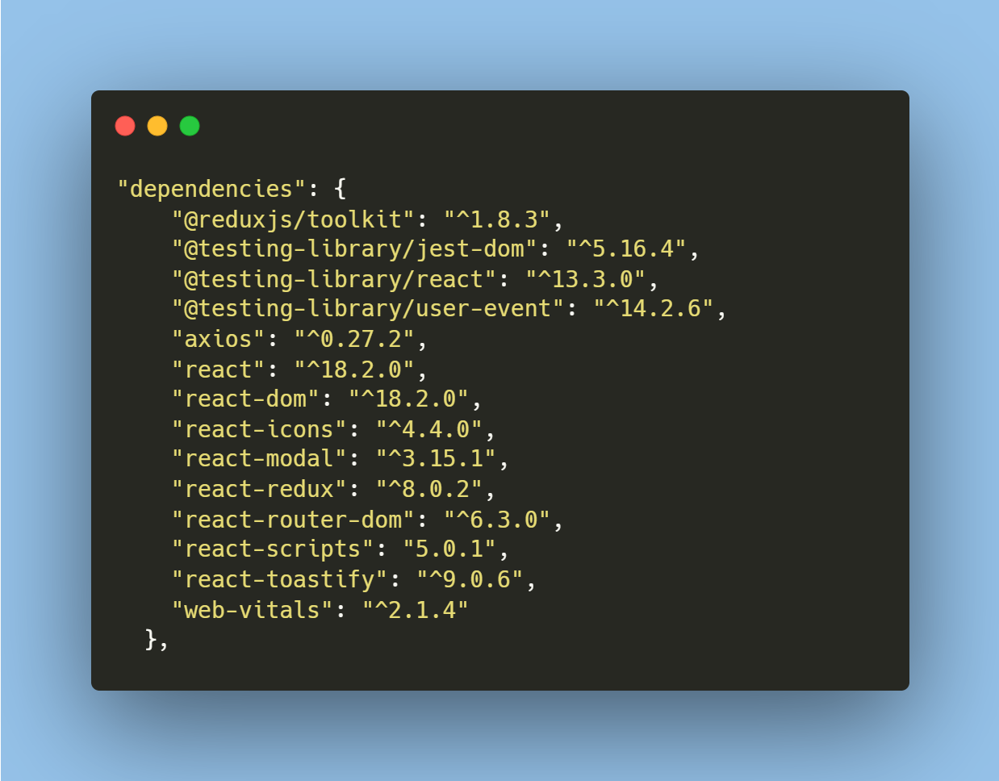
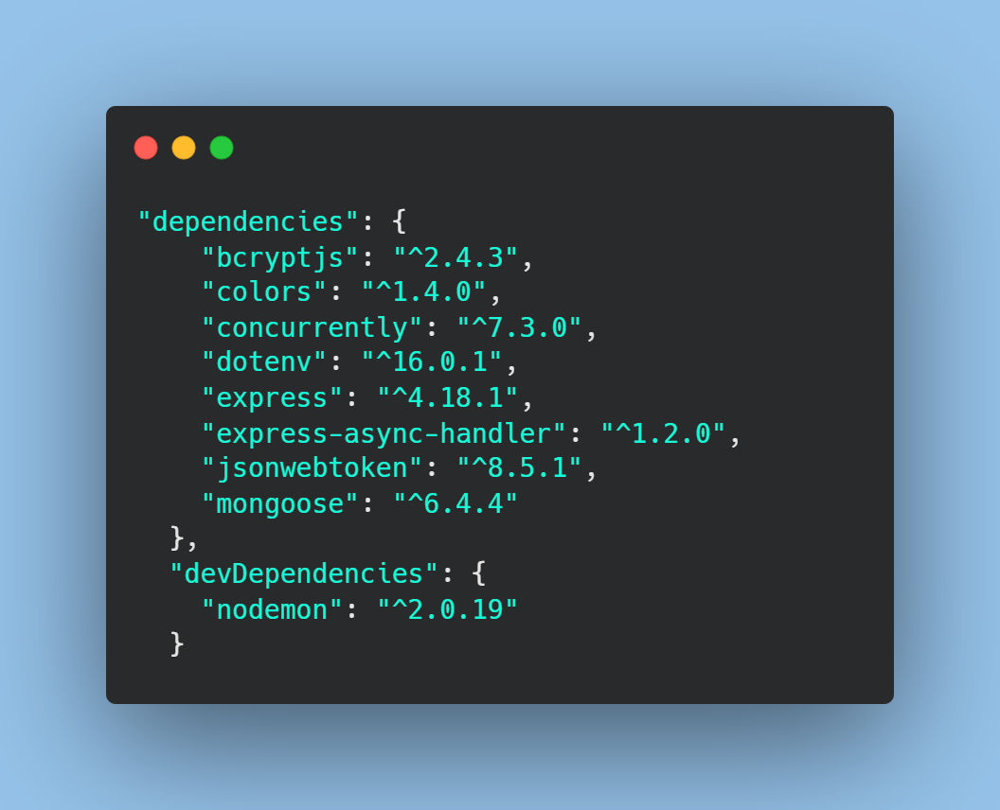
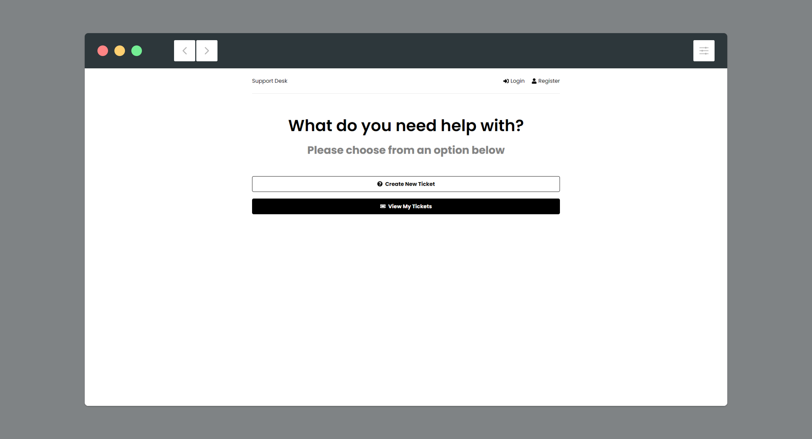

# Support Ticket Desk
Support Ticket Desk is customer support help desk. If user have any issue with product can complain here and get issue resolved.

### Developed with 
     
### Deployed on 


### Dependencies



### Scripts
```js
"scripts": {
    "start": "node backend/server.js",
    "server": "nodemon backend/server.js",
    "client": "npm start --prefix frontend",
    "dev": "concurrently \"npm run server\" \"npm run client\""
  },
 ```

### Screenshot


### Buy me Coffee
[](https://ko-fi.com/virendrakhorwal)


